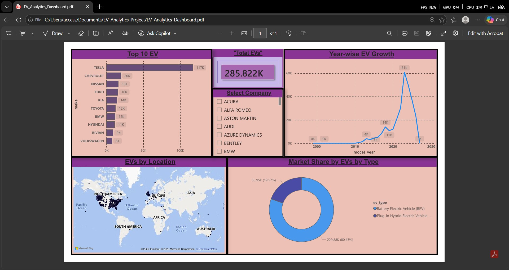

# End-to-End EV Market Analytics Project

An end-to-end Data Analytics project that extracts raw Electric Vehicle (EV) data using Python, processes and stores it in a MySQL database, and visualizes key market insights through an interactive Power BI dashboard.

## Tech Stack & Tools
**Data Ingestion/ETL:** Python (Pandas, SQLAlchemy, PyMySQL)
**Database Management:** MySQL (Workbench)
**Data Visualization & Modeling:** Power BI Desktop (Star Schema)
**IDE:** VS Code

## Project Architecture & Workflow
1. **Data Pipeline (Python):** Cleansed and converted raw EV data from CSV formats and successfully loaded '2.8 Lakh+ rows' into a structured MySQL Database using an automated Python script ('load_data.py').
2. **Database Modeling (SQL):** Divided the dataset into a Star Schema consisting of Fact ('fact_ev_registrations') and Dimension tables ('dim_location', 'dim_vehicle_specs'). Conducted deep-dive analysis using complex SQL JOINs, Aggregations, and Group By queries.
3. **Interactive Dashboard (Power BI):** Connected Power BI to the live MySQL database, established relationships, and built a dynamic executive-level dashboard for trend and market-share analysis.

## Key Insights Captured
**Total EV Registrations:** 285.8K+ vehicles analyzed.
**Market Dominance:** Tesla leads the market significantly with over 117K registrations, followed by Chevrolet and Nissan.
**Growth Trend:** A massive exponential growth spike in EV adoptions was observed post-2020.
**Geographical Hotspots:** The West Coast (specifically Seattle, WA) holds the highest density of EV registrations.
**Category Share:** Battery Electric Vehicles (BEVs) hold a dominant market share of over 80% compared to Plug-in Hybrid Electric Vehicles (PHEVs).

## Repository Structure
- 'load_data.py' -> Python ETL script used to load data into MySQL.
- 'ev_analysis_queries.sql' -> SQL script containing top business performance queries.
- 'EV_Analytics_Dashboard.pbix' -> Live Power BI Dashboard file.
- 'EV_Analytics_Dashboard.pdf' -> Static export of the interactive dashboard report.

## How to Run Locally
1. Clone this repository.
2. Setup a MySQL local server and update credentials in 'load_data.py'.
3. Run 'python load_data.py' to ingest the dataset into your database.
4. Open 'ev_analysis_queries.sql' in MySQL Workbench to test queries.
5. Open 'EV_Analytics_Dashboard.pbix' in Power BI Desktop to interact with the visual report.
